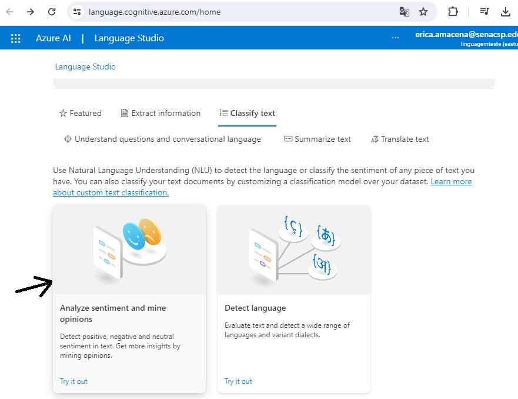
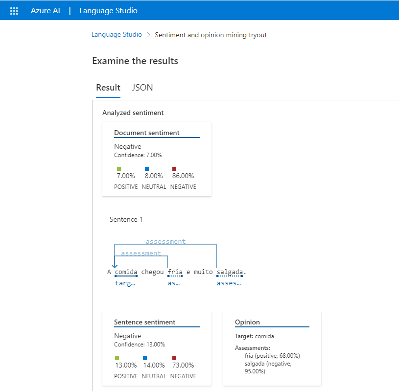
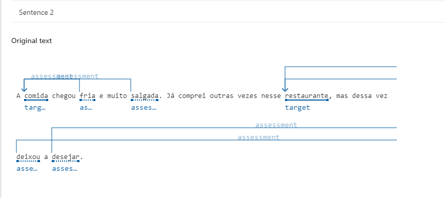

# 😄 Análise de Sentimentos com Language Studio no Azure AI 🙁

## O "Analyze Sentiment" e o "Mine Opinions" são recursos oferecidos pela plataforma Azure da Microsoft que auxiliam na análise de texto para entender as opiniões e sentimentos expressos. Aqui está uma breve explicação de cada um:

### Analyze Sentiment (Analisar Sentimento): Este recurso avalia o sentimento geral expresso em um texto, identificando se é positivo, negativo ou neutro. Utiliza técnicas de processamento de linguagem natural para analisar palavras-chave, estrutura gramatical e contexto, ajudando empresas a entender a percepção do público sobre produtos, serviços ou eventos específicos.

### Mine Opinions (Extrair Opiniões): Vai além da análise de sentimento, buscando identificar opiniões específicas expressas em um texto. Extrai informações como características específicas comentadas, razões por trás das opiniões e a intensidade dessas opiniões. É útil para empresas compreenderem feedback detalhado de clientes sobre produtos, serviços ou para entenderem tendências de mercado, ajudando na identificação de áreas de melhoria.
---

#### 1. Selecionei a opção Analyze Sentiment and mine opinions:

---

#### 2. Nessa etapa, foi necessário definir o idioma e incluir o texto:

---

#### 3. Após a análise do texto, os sentimentos foram categorizados em neutro, negativo e positivo, com percentuais correspondentes a cada categoria:

---

#### 4. Assessment: O sistema destacou as palavras "fria", "salgada" e "deixou a desejar". Isso provavelmente indica que estas são palavras chave que expressam sentimentos negativos ou insatisfação em relação à experiência no restaurante. A análise está focada em identificar aspectos específicos que contribuíram para a experiência negativa relatada.

#### Target: As palavras "comida" e "restaurante" foram destacadas como alvos ou objetos de análise. Isso sugere que o sistema identificou esses elementos como os principais focos da avaliação. No contexto da frase, "comida" representa o produto em si, enquanto "restaurante" representa o estabelecimento como um todo. 

