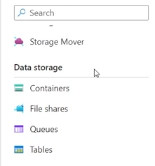

# Cognitive Search: Utilizando AI Search para indexação e consulta de Dados
---

### 1. Criei um novo recuso:

---

### 2. Em seguida, foi necessário criar uma conta de armazenamento no Storage accounts:

#### Acessei o Storage:

#### Cliquei em create:

#### Feito isso, definimos as configurações:

#### É possível armazenar dados Arquivos, Tabelas, Filas..

#### Na opção Settings, foi definido algumas configurações:

--- 

### 3. Criamos um Container e foi nomeado como coffeereviews:

