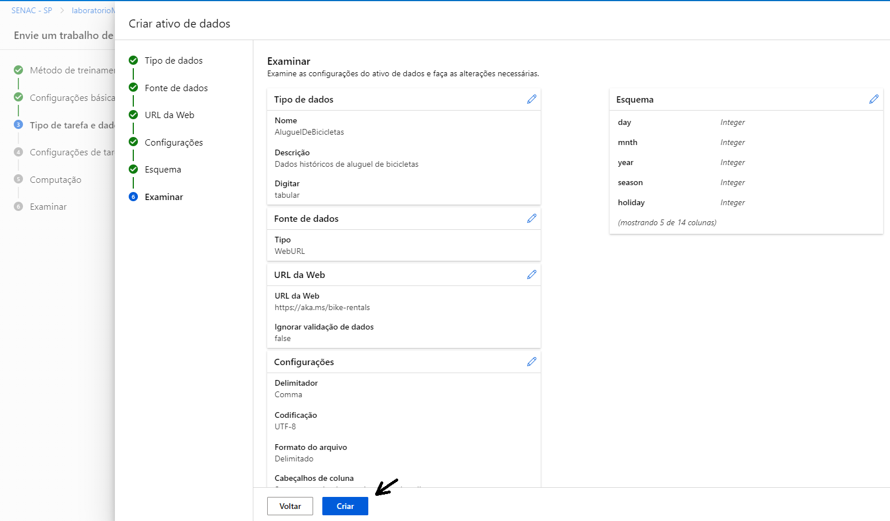

# 🚀 Machine Learning na Prática no Azure ML

##  Passo a passo de um modelo de previsão para aluguel de bicicletas 🚴🚴‍♀️:

1. Foi definido algumas configurações do projeto e a descrição do experimento

2. Continuação das configurações e definição do tipo de tarefa

