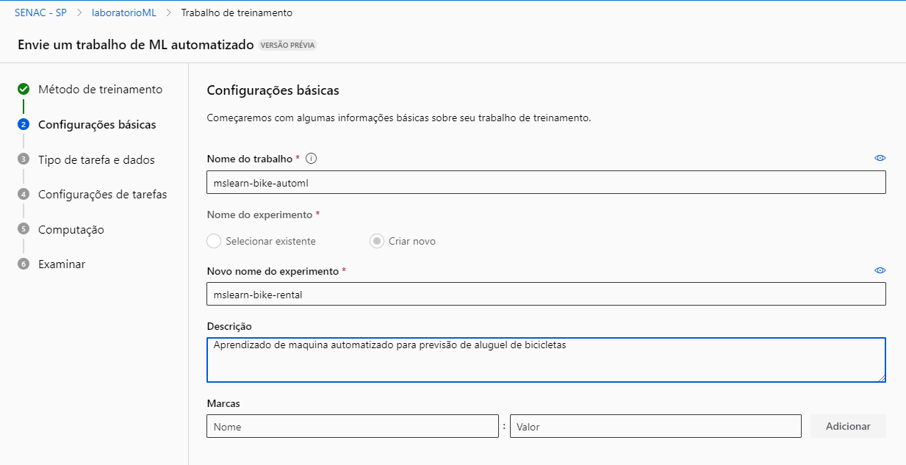
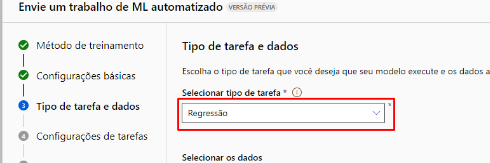
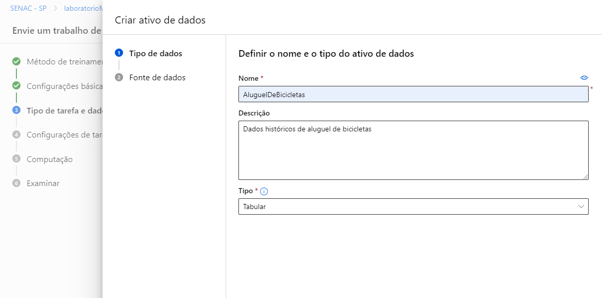
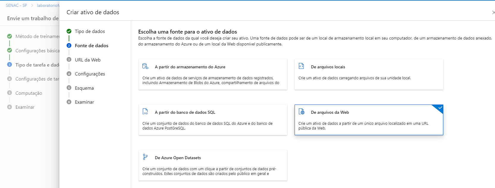
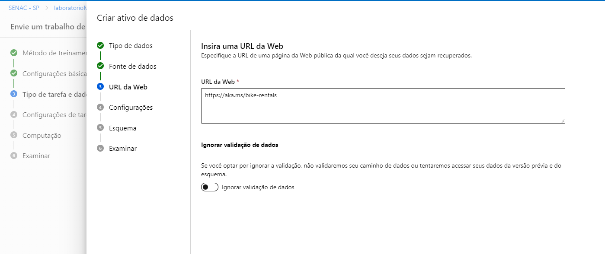
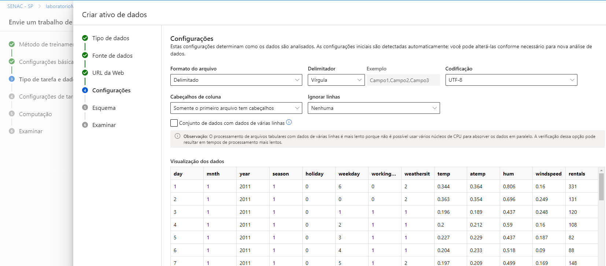
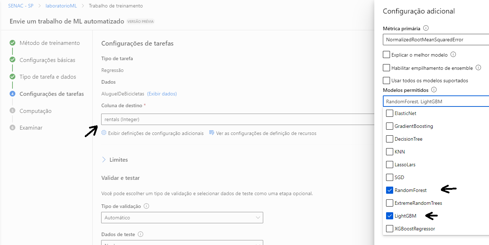
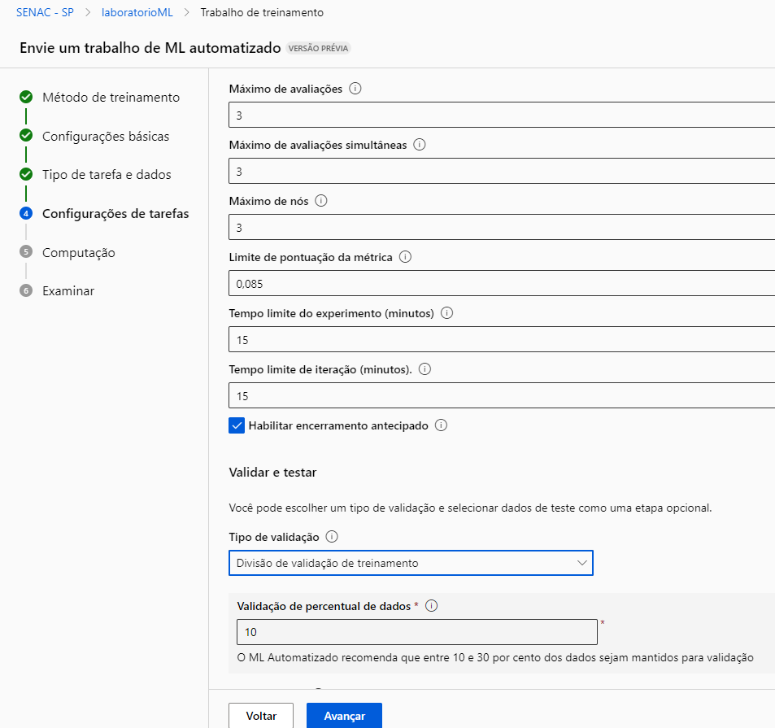
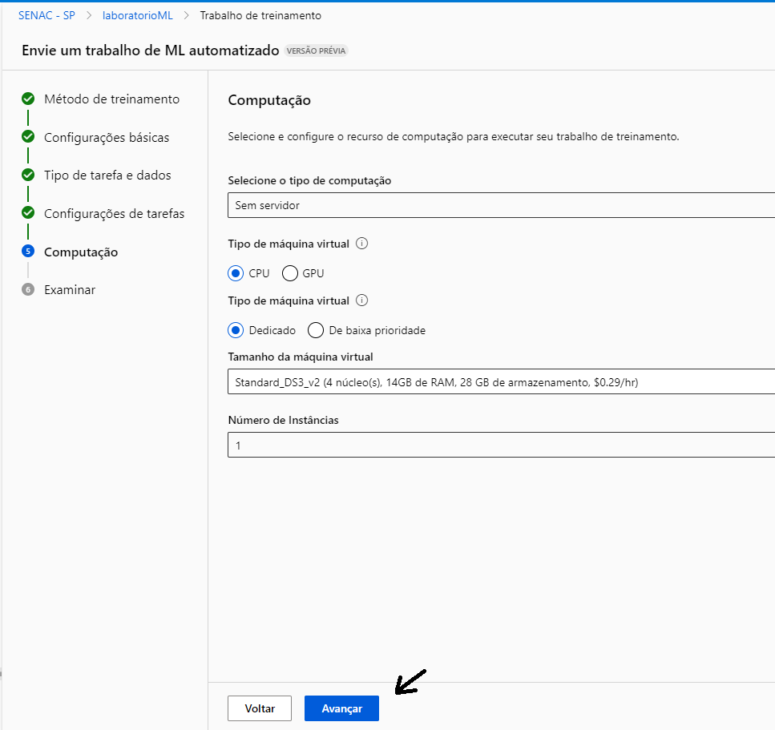

# 🚀 Machine Learning na Prática no Azure ML

##  Passo a passo de um modelo de previsão para aluguel de bicicletas 🚴🚴‍♀️:

#### 1. Foi definido algumas configurações do projeto e a descrição do experimento


---

#### 2. O tipo de tarefa é regressão


---

#### 3. Continuação das configurações e definições


---

#### 4. Foi selecionado a opção de arquivos da web


---

#### 5. URL informada no tutorial


---

#### 6. Definição do cabeçalho


---


#### 7. Configurações de tarefas


---

#### 8. Definição da opção limites


---

#### 9. Configuração em computação


---

#### 10. Status Concluído


---

#### 11. Pelo menu lateral selecionei a opção pontos de extremidade e usei o json  abaixo:

```
{
  "input_data": {
    "data": [
       {
         "day": 1,
         "mnth": 1,   
         "year": 2022,
         "season": 2,
         "holiday": 0,
         "weekday": 1,
         "workingday": 1,
         "weathersit": 2, 
         "temp": 0.3, 
         "atemp": 0.3,
         "hum": 0.3,
         "windspeed": 0.3 
       }
     ]
  }
}
```

---

#### 12. A previsão gerada foi: 361.95


